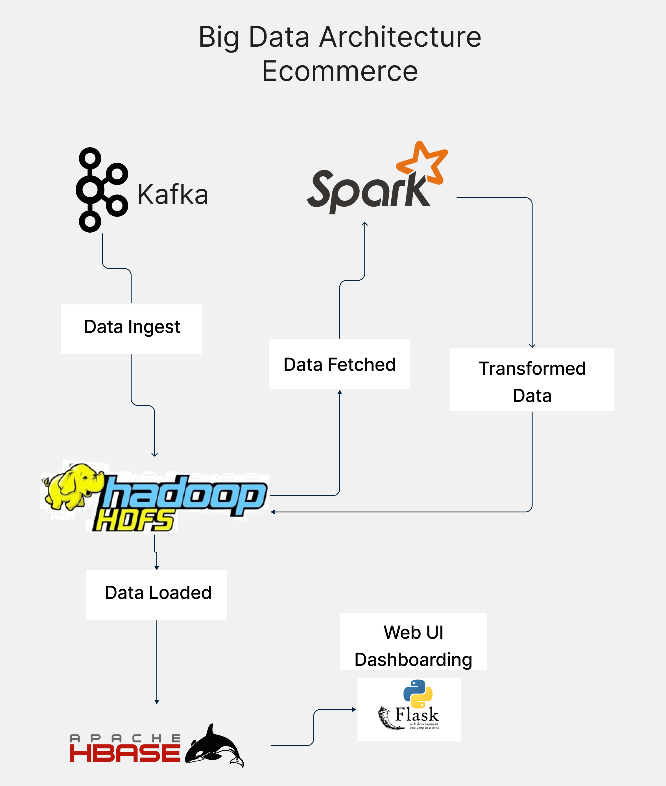

# Big Data Processing and Dashboarding Project

## **Overview**
This project demonstrates a complete end-to-end pipeline for big data processing, transformation, and visualization. The aim is to simulate a real-world scenario for processing and analyzing large-scale e-commerce data using a modern big data stack. 

### **Key Technologies Used:**
- **Data Generation:** Python (Faker library)
- **Data Ingestion:** Kafka
- **Storage:** HDFS (Hadoop Distributed File System) and HBase
- **Data Processing:** Apache Spark
- **Visualization and Dashboarding:** Flask, Python, Pandas, Matplotlib/Plotly



---

## **Data Flow**


### **1. Data Generation**
- **Why Generated Data?**
  - We were unable to find a suitable dataset of the required size on Kaggle.
  - A custom dataset was generated using Python's `Faker` library, ensuring the schema matched the project requirements.

- **Schema:**
  The data schema generated was as follows:
  ```
  - CustomerID
  - Name
  - Age
  - Country
  - RegistrationDate
  - OrderDate
  - Quantity
  - TotalAmount
  - ProductID
  - ProductName
  - Category
  - Price
  - ShippingAddress
  - ShippingDate
  - OrderID
  ```

- **Deliberate Data Errors:**
  - Missing values were introduced in TotalAmount column.
  - Errors such as typos in Country by misspelling Pakistan to "Pakist" and in productName by replacing "Gaming Console" with "GConsole".

---

### **2. Data Storage**
#### **Initial Load to HDFS**
- An **800MB chunk of data** was loaded into HDFS manually via the NameNode.
- This was done to simulate Big Data processing and emphasize the robustness of the architecture.

#### **Streaming Remaining Data via Kafka**
- The rest of the data (approx. 200MB) was streamed incrementally via **Kafka** into the NameNode, which appended to file there and replaced HDFS data.
- **Ingestion Workflow:**
  1. Python producer script streamed data row by row to Kafka.
  2. Consumer consumed data and appended to Namenode Local File.
  3. Updated data was put into HDFS.

---

### **3. Exploratory Data Analysis**
- EDA was carried out on pre-transformed data to judge what transformations should be implemented
- Box Plots, Density Grahs, Outlier and Missing Data Analysis was carried out.
- This was done on Local System by communicating with docker and also by leveraging jupyter-pyspark container.

---

### **4. Data Transformation**
#### **Apache Spark for Data Cleaning and Transformation**
  - Fixed missing values in TotalAmount column by deriving fro Product x Quantity.
  - Corrected typos in "Pakistan" spelling in Country column and replaced "GConsole" with "Gaming Console" in ProductName column.

- **Output:**
  - Transformed data was written back to HDFS in /transformation directory

---

### **5. Storing Transformed Data in HBase**
- After transformation, the cleaned and processed data was loaded into **HBase**.
- **Schema in HBase:**
  - Table Name: `ec`
  - Columns mapped to HBase column families as shown:
  - - customer:CustomerID
    - customer:Name
    - customer:Age
    - customer:Country
    - customer:RegistrationDate
    - order:OrderDate
    - order:Quantity
    - order:TotalAmount
    - product:ProductID
    - product:ProductName
    - product:Category
    - product:Price
    - shipment:ShippingAddress
    - shipment:ShippingDate
    - row_key

#### **Workflow for HBase Loading:**
- Data was written to HBase using Importtsv.
---

### **6. Data Access and Visualization**
#### **Accessing HBase Data via Thrift Server**
- Using HBase’s **Thrift Server**, we exposed a port (9090) to access the cleaned data


#### **Dashboard Creation**
- A Flask-based web application was created to display interactive dashboards.
- The Flask server connected to the Thrift Server using the port and loads the data from there 
- **Dashboards Included:**
  - Sales by Country.
  - Sales by category
  - Datewise Sales
  - Top Customers
  - Top Products
  - A specific product search field is provided. Using this, a user can find the Monthly revenue generated by that Product and the the Top 5 countries where that Product is most popular
---

## **Project Workflow**
### **1. Data Generation**
- Custom Python script generated e-commerce transactional data with realistic values and deliberate errors.

### **2. Data Ingestion**
- Data streamed to HDFS using Kafka.

### **3. Data Processing**
- Apache Spark cleaned and transformed the data.

### **4. Data Storage**
- Cleaned data was stored in HDFS and HBase for querying and visualization.

### **5. Dashboarding**
- Flask web application hosted dashboards for interactive data exploration.

---

## **Technologies Used**
| Component            | Technology        |
|----------------------|-------------------|
| Data Generation      | Python, Faker     |
| Data Ingestion       | Kafka             |
| Data Storage         | HDFS, HBase       |
| Data Processing      | Apache Spark      |
| Visualization        | Flask, Pandas, Matplotlib |

---

## **Challenges Faced**
1. **Handling Large Data Volumes:**
   - Used Kafka Streaming and Spark which is utilizes in-memory processing and so is very fast. Spark has the ability to read as much as it needs and spill rest on disk.

2. **Error Handling:**
   - Cleaning messy data required robust Spark transformations.

3. **Integration:**
   - Ensuring seamless data flow between Kafka, HDFS, Spark, HBase and Flask.

---

## **Future Improvements**
1. Implement machine learning models for advanced analytics (e.g., customer segmentation).
2. Automate the entire pipeline using tools like Apache Airflow.
3. Scale the system for even larger datasets by leveraging a distributed Kafka setup.

---

## **How to Run the Project**
1. **Generate Data:**
   - Run the Python script to generate the dataset.
2. **Start Kafka:**
   - Set up Kafka and run producer and consumer data to the `customer_orders` topic.
3. **Upload to HDFS**
   - Run the shell script named upload_to_hdfs.sh. Which puts the data in HDFS.
3. **Run Spark Job:**
   - Run the run_spark_job.sh shell script which will transform the data and put it in HDFS under a new folder.
4. **Load Data to HBase:**
   - Run the hdfs_to_hbase.sh script this will put the data in your HBASE.
5. **Start Thrift**
   - Start the thrift server in the HBASE container.
5. **Launch Flask App:**
   - Start the Flask server and access dashboards at `http://localhost:8000`.

---

## **Conclusion**
This project demonstrates a robust big data processing pipeline, showcasing data generation, ingestion, transformation, storage, and visualization. It serves as a practical example of implementing big data technologies for scalable analytics.
